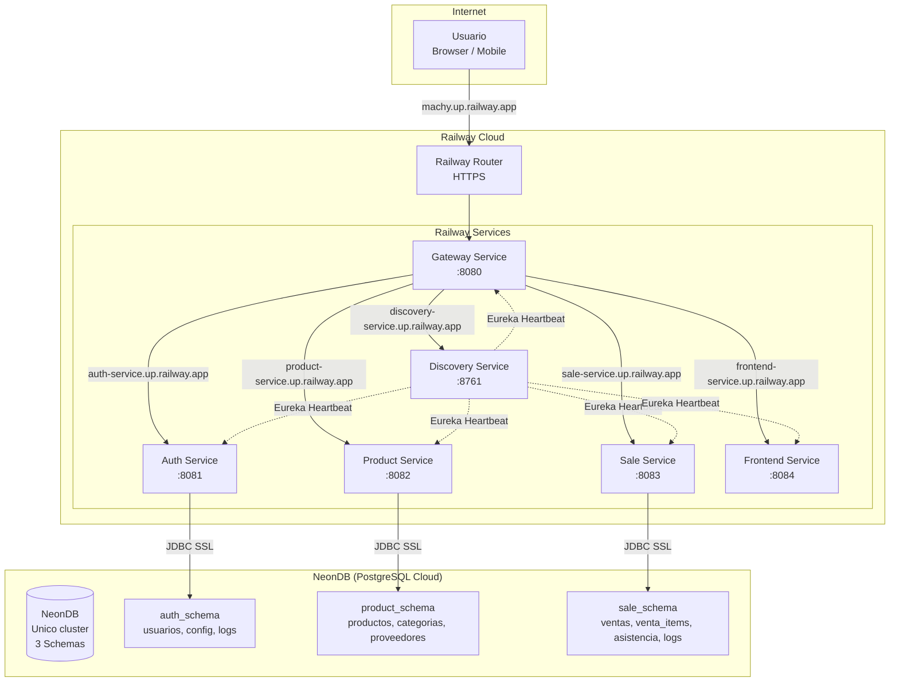
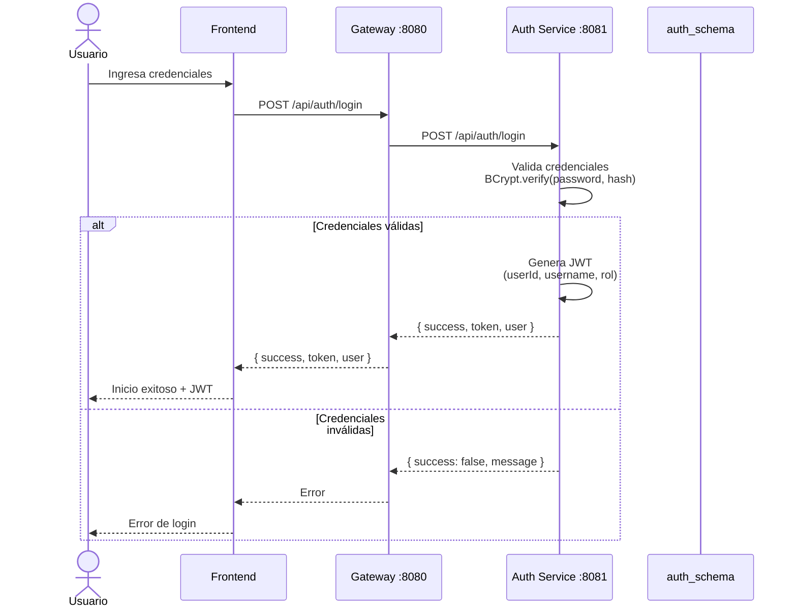
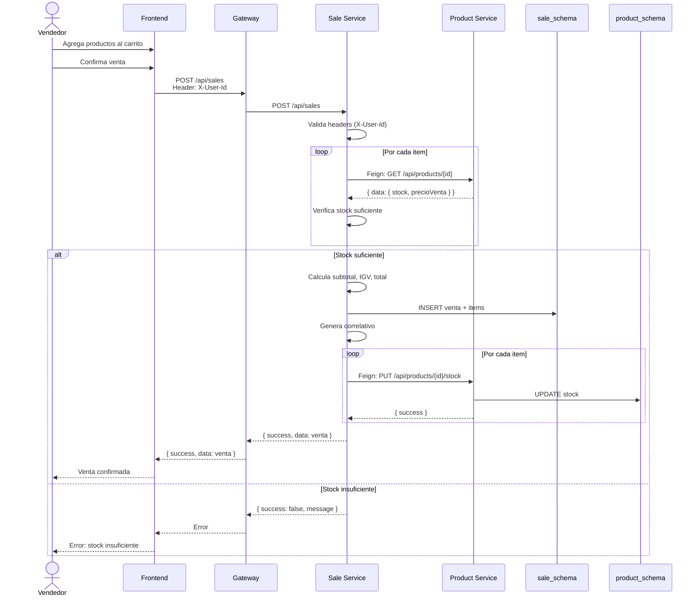
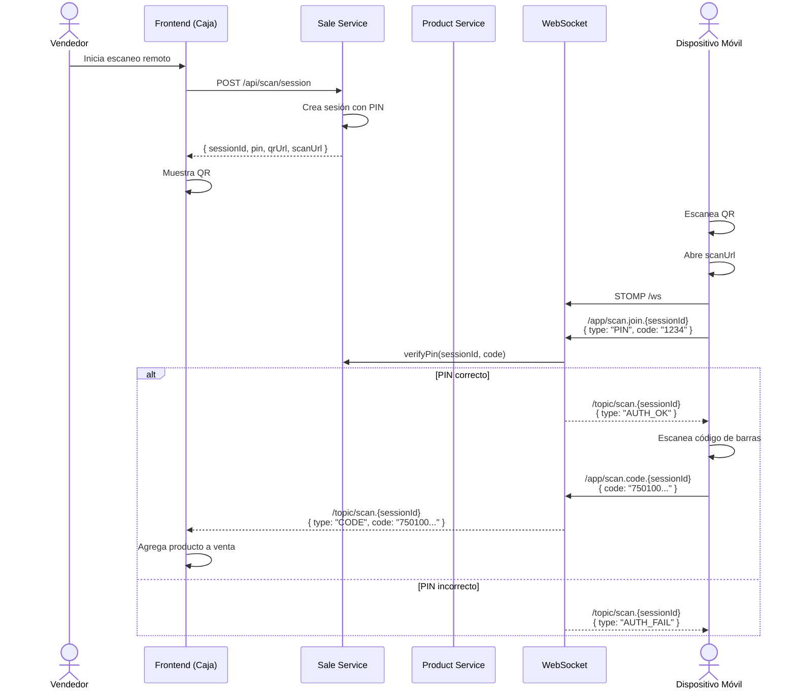
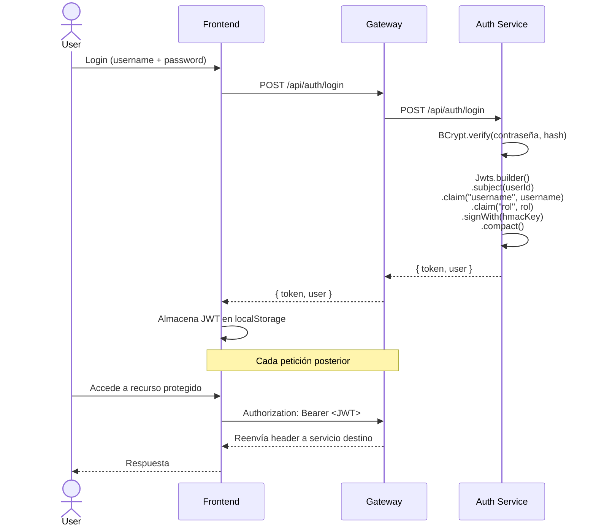
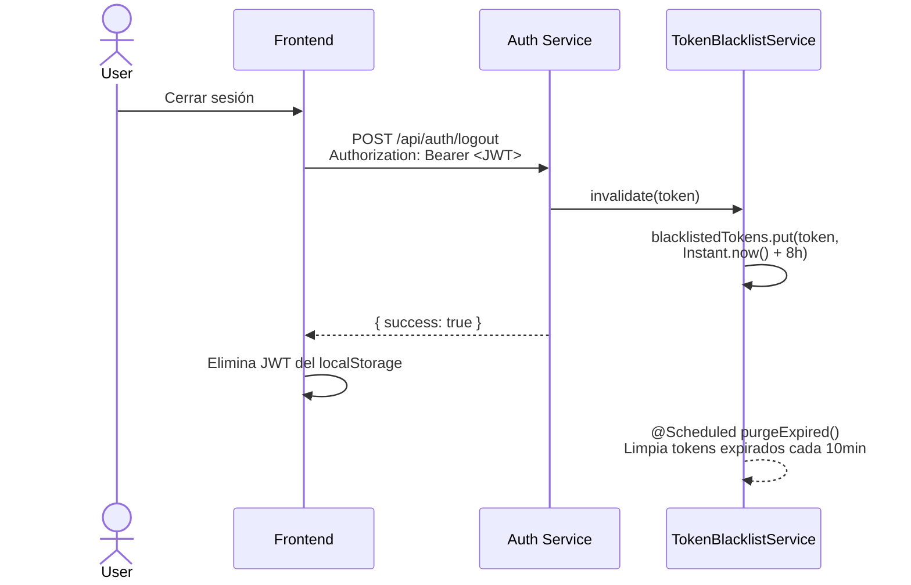

# Diseño de Arquitectura — Librería Machy v4.0

## 1. Delimitación de Dominios

Cada microservicio encapsula un dominio de negocio completamente independiente:

| Servicio | Puerto | Dominio | Responsabilidad |
|---|---|---|---|
| **discovery-service** | 8761 | Service Registry | Servidor Eureka para registro y descubrimiento automático de servicios |
| **gateway-service** | 8080 | API Gateway | Enrutamiento, balanceo de carga, CORS, Circuit Breaker |
| **auth-service** | 8081 | Usuarios y Seguridad | Autenticación JWT, gestión de usuarios, roles, configuración global, logs |
| **product-service** | 8082 | Productos e Inventario | CRUD de productos, categorías, proveedores, control de stock, alertas |
| **sale-service** | 8083 | Ventas y Operaciones | Ventas, items de venta, asistencia, dashboard, escaneo remoto, reportes |
| **frontend-service** | 8084 | Frontend | Servidor de contenido estático (HTML, CSS, JS) |

---

## 2. Bajo Acoplamiento

Los servicios se comunican **exclusivamente a través de REST APIs** mediante **Feign Clients**. Ningún servicio accede directamente a la base de datos de otro servicio.

### Comunicación entre servicios

```
sale-service ──Feign──→ product-service  (GET /api/products/{id}, PUT /api/products/{id}/stock)
sale-service ──Feign──→ auth-service     (GET /api/auth/user/id/{id}, GET /api/auth/user/{username})
```

### Mecanismos de desacoplamiento adicionales

- **Discovery Service (Eureka):** Los servicios se descubren por nombre lógico, no por URL fija.
- **Circuit Breaker (Resilience4j):** Fallos en servicios dependientes no cascadian al servicio llamante.
- **Fallback Factory:** Cada Feign Client tiene un `FallbackFactory` que devuelve respuestas por defecto cuando el servicio destino no está disponible.
- **Gateway Service:** Todo el tráfico externo pasa por un único punto de entrada. Los clientes nunca conocen la topología interna.

---

## 3. Alta Cohesión

Cada servicio tiene una **única responsabilidad bien definida**:

| Servicio | Responsabilidades | No hace |
|---|---|---|
| **discovery-service** | Registrar servicios, health checks | No almacena datos de negocio |
| **gateway-service** | Enrutar peticiones, CORS, balanceo | No tiene lógica de negocio |
| **auth-service** | Login, JWT, usuarios, roles, config global | No maneja ventas ni productos |
| **product-service** | Productos, categorías, proveedores, stock | No maneja usuarios ni ventas |
| **sale-service** | Ventas, items, asistencia, escaneo, reportes, dashboard | No maneja productos directamente (consulta via API) |

---

## 4. Diagrama de Componentes

```mermaid
graph TB
    subgraph "Frontend"
        FE[Frontend Service :8084]
    end

    subgraph "API Gateway :8080"
        GW[Gateway Service<br/>Spring Cloud Gateway<br/>CORS + Routing]
    end

    subgraph "Service Discovery :8761"
        EU[Eureka Server]
    end

    subgraph "Auth Service :8081"
        AU[Auth Service<br/>Spring Boot + Security + JPA]
        AUD[(auth_schema<br/>PostgreSQL)]
    end

    subgraph "Product Service :8082"
        PR[Product Service<br/>Spring Boot + JPA]
        PRD[(product_schema<br/>PostgreSQL)]
    end

    subgraph "Sale Service :8083"
        SA[Sale Service<br/>Spring Boot + JPA + WebSocket]
        SAD[(sale_schema<br/>PostgreSQL)]
    end

    FE -->|HTTP| GW
    GW -->|/api/auth/**| AU
    GW -->|/api/users/**| AU
    GW -->|/api/config| AU
    GW -->|/api/products/**| PR
    GW -->|/api/categories/**| PR
    GW -->|/api/suppliers/**| PR
    GW -->|/api/sales/**| SA
    GW -->|/api/dashboard| SA
    GW -->|/api/attendance/**| SA
    GW -->|/api/scan/**| SA
    GW -->|/ws/**| SA

    AU -->|Register| EU
    PR -->|Register| EU
    SA -->|Register| EU
    GW -->|Register| EU
    FE -->|Register| EU

    SA -->|Feign: GET /api/products/{id}| PR
    SA -->|Feign: PUT /api/products/{id}/stock| PR
    SA -->|Feign: GET /api/auth/user/id/{id}| AU
    SA -->|Feign: GET /api/auth/user/{username}| AU

    AU --> AUD
    PR --> PRD
    SA --> SAD
```

---

## 5. Diagrama de Despliegue (Railway + NeonDB)



---

## 6. Diagramas de Secuencia

### 6.1 Login Flow



### 6.2 Venta Flow (con verificación de stock)



### 6.3 Escaneo Remoto Flow (WebSocket)



---

## 7. API Endpoints

### 7.1 Auth Service (`/api/auth/**`, `/api/users/**`, `/api/config`)

| Método | Ruta | Descripción | Seguridad |
|--------|------|-------------|-----------|
| `POST` | `/api/auth/login` | Inicio de sesión (JWT) | Público |
| `POST` | `/api/auth/logout` | Cerrar sesión (blacklist token) | Autenticado |
| `POST` | `/api/auth/recover` | Recuperación de contraseña | Público |
| `GET` | `/api/auth/user/{username}` | Obtener usuario por username | Interno (Feign) |
| `GET` | `/api/auth/user/id/{id}` | Obtener usuario por ID | Interno (Feign) |
| `GET` | `/api/users` | Listar todos los usuarios | Autenticado |
| `GET` | `/api/users/{id}` | Obtener usuario por ID | Autenticado |
| `POST` | `/api/users` | Crear usuario | Admin |
| `PUT` | `/api/users/{id}` | Actualizar usuario | Admin |
| `PATCH` | `/api/users/{id}/toggle` | Activar/desactivar usuario | Admin |
| `GET` | `/api/auth/backup/export` | Exportar datos | Admin |
| `POST` | `/api/auth/backup/import` | Importar datos | Admin |
| `GET` | `/api/config` | Obtener configuración global | Autenticado |
| `PUT` | `/api/config` | Guardar configuración global | Admin |

### 7.2 Product Service (`/api/products/**`, `/api/categories/**`, `/api/suppliers/**`)

| Método | Ruta | Descripción | Seguridad |
|--------|------|-------------|-----------|
| `GET` | `/api/products` | Listar productos (con filtros) | Público |
| `GET` | `/api/products/active` | Listar productos activos | Público |
| `GET` | `/api/products/{id}` | Obtener producto por ID | Público |
| `GET` | `/api/products/by-code/{codigo}` | Obtener producto por código | Público |
| `POST` | `/api/products` | Crear producto | Admin |
| `PUT` | `/api/products/{id}` | Actualizar producto | Admin |
| `PATCH` | `/api/products/{id}/toggle` | Activar/desactivar producto | Admin |
| `PUT` | `/api/products/{id}/stock` | Ajustar stock | Interno (Feign) / Admin |
| `GET` | `/api/products/inventory-summary` | Resumen de inventario | Público |
| `GET` | `/api/categories` | Listar categorías | Público |
| `GET` | `/api/categories/active` | Listar categorías activas | Público |
| `GET` | `/api/categories/{id}` | Obtener categoría | Público |
| `POST` | `/api/categories` | Crear categoría | Admin |
| `PUT` | `/api/categories/{id}` | Actualizar categoría | Admin |
| `PATCH` | `/api/categories/{id}/toggle` | Activar/desactivar categoría | Admin |
| `GET` | `/api/suppliers` | Listar proveedores | Público |
| `GET` | `/api/suppliers/active` | Listar proveedores activos | Público |
| `GET` | `/api/suppliers/{id}` | Obtener proveedor | Público |
| `POST` | `/api/suppliers` | Crear proveedor | Admin |
| `PUT` | `/api/suppliers/{id}` | Actualizar proveedor | Admin |
| `PATCH` | `/api/suppliers/{id}/toggle` | Activar/desactivar proveedor | Admin |
| `GET` | `/api/products/backup/export` | Exportar datos | Admin |
| `POST` | `/api/products/backup/import` | Importar datos | Admin |

### 7.3 Sale Service (`/api/sales/**`, `/api/attendance/**`, `/api/scan/**`, `/api/dashboard`)

| Método | Ruta | Descripción | Seguridad |
|--------|------|-------------|-----------|
| `GET` | `/api/sales` | Listar ventas (filtro por vendedor) | Autenticado |
| `GET` | `/api/sales/{id}` | Obtener venta por ID | Autenticado |
| `POST` | `/api/sales` | Crear venta (descuenta stock) | Autenticado |
| `POST` | `/api/sales/{id}/cancel` | Anular venta (restaura stock) | Autenticado |
| `GET` | `/api/sales/reports` | Reporte de ventas | Autenticado |
| `GET` | `/api/attendance/status` | Estado de asistencia hoy | Autenticado |
| `POST` | `/api/attendance/check-in` | Marcar entrada | Autenticado |
| `POST` | `/api/attendance/check-out` | Marcar salida | Autenticado |
| `GET` | `/api/attendance/weekly-report` | Informe semanal de asistencia | Admin |
| `GET` | `/api/attendance/log` | Log detallado de asistencia | Admin |
| `POST` | `/api/attendance/admin` | Marcar asistencia de otro usuario | Admin |
| `POST` | `/api/scan/session` | Crear sesión de escaneo (genera QR) | Autenticado |
| `POST` | `/api/scan/session/{id}/verify-pin` | Verificar PIN de sesión | Interno |
| `POST` | `/api/scan/session/{id}/code` | Enviar código escaneado | Interno |
| `DELETE` | `/api/scan/session/{id}` | Finalizar sesión de escaneo | Autenticado |
| `GET` | `/api/dashboard` | Dashboard: ventas hoy, totales, ingresos | Autenticado |
| `GET` | `/api/sales/backup/export` | Exportar datos | Admin |
| `POST` | `/api/sales/backup/import` | Importar datos | Admin |
| `WS` | `/ws` | WebSocket para escaneo remoto | Interno |

**Total de endpoints: 57**

---

## 8. Arquitectura de Seguridad

### 8.1 Flujo de Autenticación JWT



### 8.2 Token Blacklist (Logout)



### 8.3 BCrypt Password Encoding

- Almacenamiento: `password_hash` columna en `auth_schema.usuarios`
- Encoding: `BCryptPasswordEncoder(12)` — 12 rounds de hashing
- Verificación: `passwordEncoder.matches(rawPassword, user.getPasswordHash())`

### 8.4 X-User-Id Header Pattern (Service-to-Service)

Para comunicación entre servicios autenticados, el sale-service recibe headers `X-User-Id` y `X-User-Rol` desde el gateway. Estos headers son inyectados por el frontend al llamar al gateway con el JWT. El servicio destino utiliza estos headers para:

- Filtrar ventas por vendedor (si no es admin)
- Registrar el vendedor en la venta
- Verificar permisos

### 8.5 Gateway CORS Configuration

```java
// GatewayConfig.java
CorsConfiguration config = new CorsConfiguration();
config.setAllowedOrigins(List.of("*"));
config.setAllowedMethods(List.of("GET", "POST", "PUT", "DELETE", "PATCH", "OPTIONS"));
config.setAllowedHeaders(List.of("*"));
config.setExposedHeaders(List.of("Authorization"));
```

Configuración en `application.yml`:

```yaml
spring:
  cloud:
    gateway:
      globalcors:
        cors-configurations:
          '[/**]':
            allowedOrigins: ${CORS_ORIGINS:*}
            allowedMethods: [GET, POST, PUT, DELETE, PATCH, OPTIONS]
            allowedHeaders: "*"
```

### 8.6 Resumen de Seguridad

| Aspecto | Implementación |
|---------|---------------|
| **Hashing de contraseñas** | BCrypt con 12 rounds (`BCryptPasswordEncoder(12)`) |
| **Token** | JWT firmado con HMAC-SHA (256 bits), expiración 8h |
| **Claims JWT** | `sub` (userId), `username`, `rol` |
| **Logout** | Token blacklist en memoria con expiración automática |
| **CSRF** | Deshabilitado (API stateless) |
| **CORS** | Gateway configurado con `*` origins |
| **Service-to-service** | Headers `X-User-Id`, `X-User-Rol`, `X-User-Nombre` |
| **Session** | Stateless (`SessionCreationPolicy.STATELESS`) |

---

## 9. Base de Datos por Servicio

Cada servicio tiene su propio esquema en un único clúster NeonDB PostgreSQL. Un mismo clúster con 3 schemas evita la complejidad de múltiples bases de datos conservando el aislamiento lógico.

### 9.1 `auth_schema` — Auth Service

Tabla `usuarios`:
| Columna | Tipo | Descripción |
|---------|------|-------------|
| `id` | UUID (PK) | Identificador único |
| `nombre` | VARCHAR(100) | Nombres |
| `apellidos` | VARCHAR(100) | Apellidos |
| `dni` | VARCHAR(8) | Documento de identidad |
| `telefono` | VARCHAR(20) | Teléfono |
| `correo` | VARCHAR(200) | Correo electrónico (único) |
| `username` | VARCHAR(50) | Nombre de usuario (único) |
| `password_hash` | TEXT | Hash BCrypt(12) de la contraseña |
| `rol` | VARCHAR(20) | Rol: `admin`, `vendedor` |
| `turno` | VARCHAR(20) | Turno: `mañana`, `tarde` |
| `activo` | BOOLEAN | Estado activo/inactivo |
| `intentos_fallidos` | INTEGER | Intentos de login fallidos |
| `bloqueado_hasta` | TIMESTAMP | Bloqueo temporal |
| `ultimo_acceso` | TIMESTAMP | Último login exitoso |
| `created_at` | TIMESTAMP | Fecha de creación |
| `updated_at` | TIMESTAMP | Fecha de actualización |

Tabla `config`:
| Columna | Tipo | Descripción |
|---------|------|-------------|
| `clave` | VARCHAR(100) (PK) | Nombre de la configuración |
| `valor` | TEXT | Valor de la configuración |
| `updated_at` | TIMESTAMP | Última modificación |

Tabla `logs`:
| Columna | Tipo | Descripción |
|---------|------|-------------|
| `id` | UUID (PK) | Identificador |
| `nivel` | VARCHAR(20) | Nivel de log |
| `modulo` | VARCHAR(100) | Módulo |
| `mensaje` | TEXT | Mensaje del log |
| `usuario_id` | UUID (FK) | Usuario relacionado |
| `contexto` | TEXT | Contexto adicional |
| `created_at` | TIMESTAMP | Fecha de creación |

### 9.2 `product_schema` — Product Service

Tabla `productos`:
| Columna | Tipo | Descripción |
|---------|------|-------------|
| `id` | UUID (PK) | Identificador único |
| `codigo` | VARCHAR(50) | Código de barras (único) |
| `nombre` | VARCHAR(200) | Nombre del producto |
| `descripcion` | TEXT | Descripción |
| `categoria_id` | UUID (FK) | Relación con categoría |
| `categoria` | VARCHAR(100) | Nombre de categoría (denormalizado) |
| `unidad` | VARCHAR(50) | Unidad de medida |
| `precio_compra` | DECIMAL(10,2) | Precio de compra |
| `precio_venta` | DECIMAL(10,2) | Precio de venta |
| `stock` | INTEGER | Stock actual |
| `stock_minimo` | INTEGER | Stock mínimo para alerta |
| `proveedor_id` | UUID (FK) | Relación con proveedor |
| `proveedor_nombre` | VARCHAR(200) | Nombre del proveedor (denormalizado) |
| `estado` | VARCHAR(20) | Estado: `activo`, `inactivo` |
| `created_at` | TIMESTAMP | Fecha de creación |
| `updated_at` | TIMESTAMP | Fecha de actualización |

Tabla `categorias`:
| Columna | Tipo | Descripción |
|---------|------|-------------|
| `id` | UUID (PK) | Identificador |
| `nombre` | VARCHAR(100) | Nombre (único) |
| `descripcion` | TEXT | Descripción |
| `activo` | BOOLEAN | Estado activo/inactivo |
| `created_at` | TIMESTAMP | Creación |
| `updated_at` | TIMESTAMP | Actualización |

Tabla `proveedores`:
| Columna | Tipo | Descripción |
|---------|------|-------------|
| `id` | UUID (PK) | Identificador |
| `nombre` | VARCHAR(200) | Nombre o razón social |
| `ruc` | VARCHAR(11) | RUC |
| `contacto` | VARCHAR(100) | Persona de contacto |
| `telefono` | VARCHAR(20) | Teléfono |
| `email` | VARCHAR(100) | Correo electrónico |
| `direccion` | TEXT | Dirección |
| `activo` | BOOLEAN | Estado activo/inactivo |
| `created_at` | TIMESTAMP | Creación |
| `updated_at` | TIMESTAMP | Actualización |

### 9.3 `sale_schema` — Sale Service

Tabla `ventas`:
| Columna | Tipo | Descripción |
|---------|------|-------------|
| `id` | UUID (PK) | Identificador |
| `numero` | INTEGER | Correlativo automático |
| `num_comp` | INTEGER | Número de comprobante |
| `vendedor_id` | UUID | ID del vendedor (desde auth-service) |
| `vendedor_nombre` | VARCHAR(200) | Nombre del vendedor |
| `items` | TEXT | JSON de items (denormalizado) |
| `subtotal` | DECIMAL(10,2) | Subtotal |
| `descuento` | DECIMAL(10,2) | Descuento |
| `total` | DECIMAL(10,2) | Total pagado |
| `igv` | DECIMAL(10,2) | IGV (18%) |
| `cliente` | VARCHAR(200) | Nombre del cliente |
| `cliente_dni` | VARCHAR(20) | DNI del cliente |
| `estado` | VARCHAR(20) | Estado: `confirmada`, `anulada` |
| `boleta` | BOOLEAN | Generar boleta |
| `boleta_generada` | BOOLEAN | Boleta emitida |
| `paga_con` | DECIMAL(10,2) | Monto con que paga |
| `vuelto` | DECIMAL(10,2) | Vuelto calculado |
| `motivo_anulacion` | TEXT | Motivo si está anulada |
| `created_at` | TIMESTAMP | Creación |
| `updated_at` | TIMESTAMP | Actualización |

Tabla `venta_items`:
| Columna | Tipo | Descripción |
|---------|------|-------------|
| `id` | UUID (PK) | Identificador |
| `venta_id` | UUID (FK) | Venta padre |
| `producto_id` | UUID | ID del producto (desde product-service) |
| `codigo` | VARCHAR(50) | Código de barras |
| `nombre_producto` | VARCHAR(200) | Nombre del producto (denormalizado) |
| `categoria` | VARCHAR(100) | Categoría |
| `cantidad` | INTEGER | Cantidad vendida |
| `precio_unitario` | DECIMAL(10,2) | Precio unitario |
| `subtotal` | DECIMAL(10,2) | Subtotal del item |
| `created_at` | TIMESTAMP | Creación |

Tabla `asistencia`:
| Columna | Tipo | Descripción |
|---------|------|-------------|
| `id` | UUID (PK) | Identificador |
| `usuario_id` | UUID | ID del usuario (desde auth-service) |
| `nombre` | VARCHAR(200) | Nombre del usuario (denormalizado) |
| `fecha` | DATE | Fecha de la asistencia |
| `hora_entrada` | TIME | Hora de entrada |
| `hora_salida` | TIME | Hora de salida |
| `turno` | VARCHAR(20) | Turno del usuario |
| `horas` | DECIMAL(5,2) | Horas trabajadas |
| `tardanza_min` | INTEGER | Minutos de tardanza |
| `cumple_turno` | BOOLEAN | Si cumplió el turno completo |
| `estado_asistencia` | VARCHAR(20) | Estado: `a tiempo`, `tardanza`, `falta` |
| `created_at` | TIMESTAMP | Creación |

Tabla `logs`:
| Columna | Tipo | Descripción |
|---------|------|-------------|
| `id` | UUID (PK) | Identificador |
| `nivel` | VARCHAR(20) | Nivel de log |
| `modulo` | VARCHAR(100) | Módulo |
| `mensaje` | TEXT | Mensaje |
| `usuario_id` | UUID | Usuario relacionado |
| `contexto` | TEXT | Contexto adicional |
| `created_at` | TIMESTAMP | Creación |

---

## Resumen del Diseño

| Dimensión | Evaluación |
|-----------|------------|
| **Patrón arquitectónico** | Microservicios con API Gateway + Service Discovery |
| **Comunicación** | REST síncrono (Feign Clients) entre servicios; WebSocket para escaneo remoto |
| **Base de datos** | Database-per-service (3 schemas PostgreSQL en NeonDB) |
| **Seguridad** | JWT stateless con blacklist para logout; BCrypt(12) |
| **Resiliencia** | Circuit Breaker Resilience4j + Fallback Factory en Feign |
| **Descubrimiento** | Eureka Server con registro automático |
| **Despliegue** | Docker multi-stage en Railway.app |
| **Frontend** | Servicio estático separado (frontend-service) |
